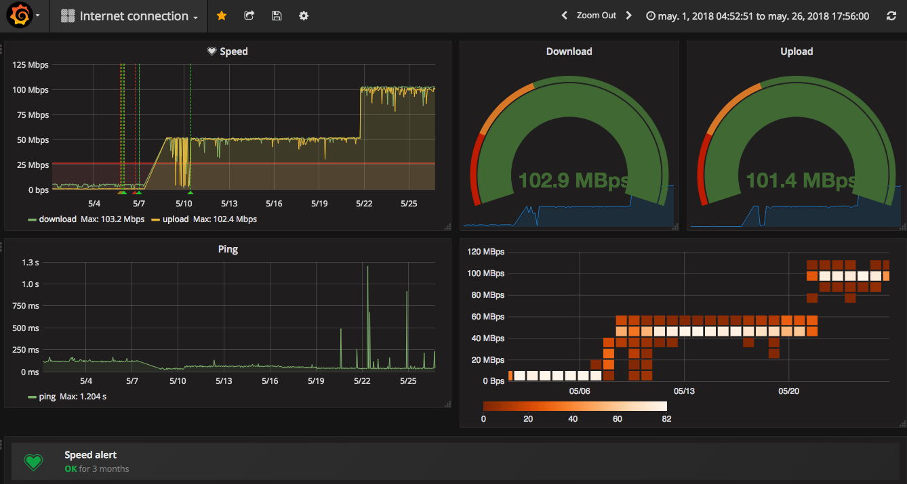

## Monitoring the bandwidth with Grafana, InfluxDB and Docker

Time ago, when I was an ADSL user in my house I had a lot problems with my internet connection. I was a bit lazy to switch to a new fiber connection. Finally I changed it, but meanwhile the my Internet company was solving one incident, I started to hack a little bit a simple and dirty script that monitors my connection speed (just for fun and to practise with InfluxDB and Grafana).

Today I've lost my quick and dirty script (please Gonzalo keep a working backup the SD card of your Raspberry Pi Server always updated! Sometimes it crashes. It's simple: "dd if=/dev/disk3 of=pi3.img" :) and I want to rebuild it. This time I want to use Docker (just for fun). Let's start.

To monitor the bandwidth we only need to use the speedtest-cli api. We can use this api from command line and, as it's a python library, we can create one python script that uses it.

```python
import datetime
import logging
import os
import speedtest
import time
from dotenv import load_dotenv
from influxdb import InfluxDBClient

logging.basicConfig(level=logging.INFO)

current_dir = os.path.dirname(os.path.abspath(__file__))
load_dotenv(dotenv_path="{}/.env".format(current_dir))

influxdb_host = os.getenv("INFLUXDB_HOST")
influxdb_port = os.getenv("INFLUXDB_PORT")
influxdb_database = os.getenv("INFLUXDB_DATABASE")

def persists(measurement, fields, time):
    logging.info("{} {} {}".format(time, measurement, fields))

    influx_client.write_points([{
        "measurement": measurement,
        "time": time,
        "fields": fields
    }])

influx_client = InfluxDBClient(host=influxdb_host, port=influxdb_port, database=influxdb_database)

def get_speed():
    logging.info("Calculating speed ...")
    s = speedtest.Speedtest()
    s.get_best_server()
    s.download()
    s.upload()

    return s.results.dict()

def loop(sleep):
    current_time = datetime.datetime.utcnow().isoformat()
    speed = get_speed()

    persists(measurement='download', fields={"value": speed['download']}, time=current_time)
    persists(measurement='upload', fields={"value": speed['upload']}, time=current_time)
    persists(measurement='ping', fields={"value": speed['ping']}, time=current_time)

    time.sleep(sleep)

while True:
    loop(sleep=60 * 60) # each hour
```

Now we need to create the docker-compose file to orchestrate the infrastructure. The most complicate thing here is maybe configure grafana within docker files instead of opening browser, create datasoruce and build dashboard by hand. After a couple of hours navigating into github repositories finally I created exactly what I needed for this post. Basically is a custom entry point for my grafana host that creates the datasource and dashboard (via Grafana's API)

```yml
version: '3'

services:
  check:
    image: gonzalo123.check
    restart: always
    volumes:
    - ./src/beat:/code/src
    depends_on:
    - influxdb
    build:
      context: ./src
      dockerfile: .docker/Dockerfile-check
    networks:
    - app-network
    command: /bin/sh start.sh
  influxdb:
    image: influxdb:latest
    restart: always
    environment:
    - INFLUXDB_INIT_PWD="${INFLUXDB_PASS}"
    - PRE_CREATE_DB="${INFLUXDB_DB}"
    volumes:
    - influxdb-data:/data
    networks:
    - app-network
  grafana:
    image: grafana/grafana:latest
    restart: always
    ports:
    - "3000:3000"
    depends_on:
    - influxdb
    volumes:
    - grafana-db:/var/lib/grafana
    - grafana-log:/var/log/grafana
    - grafana-conf:/etc/grafana
    networks:
    - app-network

networks:
  app-network:
    driver: bridge

volumes:
  grafana-db:
    driver: local
  grafana-log:
    driver: local
  grafana-conf:
    driver: local
  influxdb-data:
    driver: local
```
Note: this docker-compose file is not valid for a raspberry pi. Our Pi uses an ARM architecture so we need binaries for this architecture. 

And that's all. My Internet connection supervised again.

